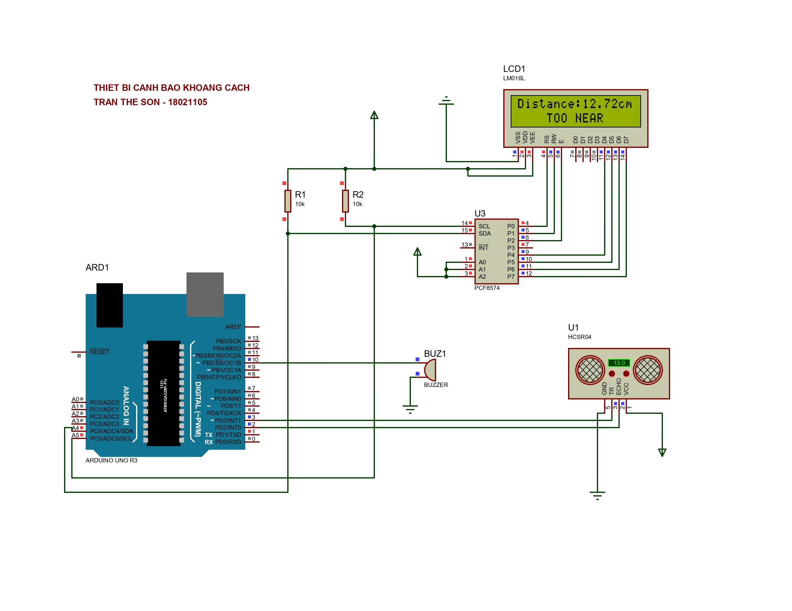
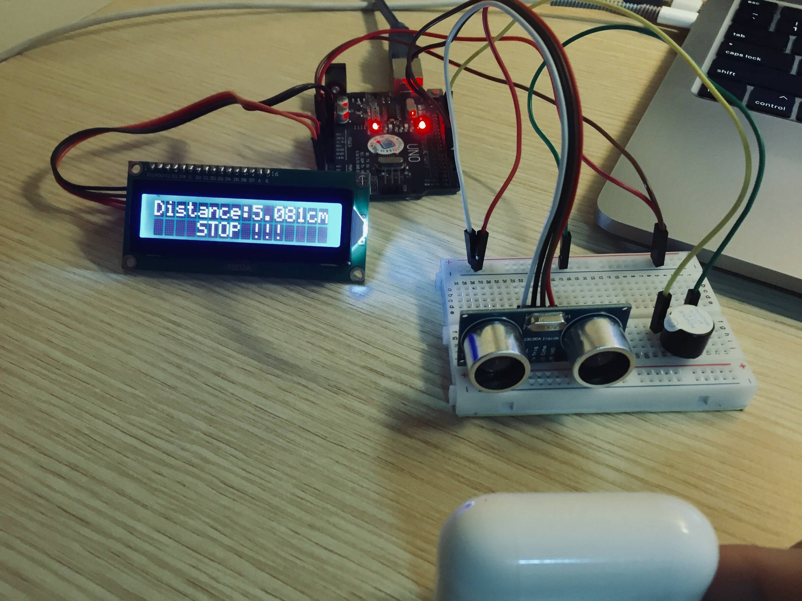

# Thiết bị cảnh báo khoảng cách

## Một số linh kiện sử dụng

- Arduino UNO R3
- Mạch chuyển đổi giao tiếp I2C
- Cảm biến siêu âm HC-SR04
- Led LCD 1602A
- Còi Buzz

## Các bước đấu nối thiết bị

- Chân SDA của I2C nối với cổng A4 của arduino
- Chân SCL của I2C nối với cổng A5 của arduino
- Kết nối các chân của I2C với led LCD 1602A
- Chân trigger của HC-SR04 nối với cổng 3 của arduino
- Chân echo của HC-SR04 nối với cổng 2 của arduino
- Cực dương của còi buzz nối với cổng 10 của arduino
- Cực âm của còi buzz nối với đất
- Nối VCC và Ground của I2C với nguồn và đất
- Nối VCC và Ground của HC-SR04 với nguồn và đất

## Thiết kế mạch trên proteus

## Sản phẩm thực tế

